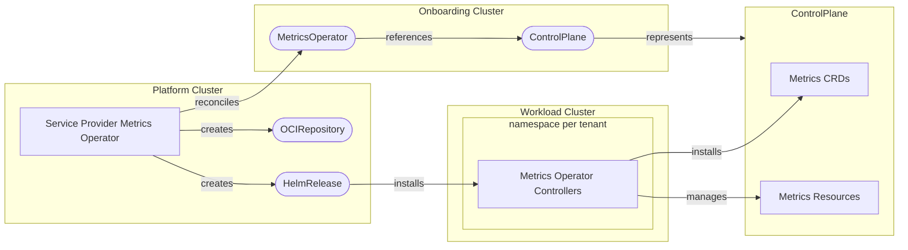

[](https://api.reuse.software/info/github.com/openmcp-project/service-provider-metrics-operator)

# 📊 service-provider-metrics-operator

A service provider for managing [Metrics Operator](https://github.com/openmcp-project/metrics-operator) deployments within a `ControlPlane` environment. This provider enables automated metrics collection capabilities by installing and configuring the Metrics Operator on managed control planes.

## 📖 Overview

The Metrics Operator service provider automates the lifecycle management of Metrics Operator installations, including:

- 🔄 **Automated Deployment** - Deploys Metrics Operator via Helm to `ControlPlane`s
- 📦 **Air-Gapped Support** - Full support for private registries via custom chart URLs and pull secrets
- 📊 **Status Tracking** - With the `metrics-operator`: Real-time status reporting of all managed resources
- 🔒 **Deletion Protection** - Blocks `MetricsOperator` deletion while `*Metric` CRs still exist on the `ControlPlane`

## 🏗️ Architecture



## 🚦 Getting Started

### Prerequisites

- Go 1.26+
- [Task](https://taskfile.dev/) (task runner)
- Docker (for building images)
- Access to an openMCP environment (Kind or a real cluster) for testing the service provider

### 🛠️ Local Development

1. **Clone the repository**

   ```bash
   git clone https://github.com/openmcp-project/service-provider-metrics-operator.git
   cd service-provider-metrics-operator
   ```

2. **Install dependencies**

   ```bash
   go mod download
   ```

3. **Build the binary**

   ```bash
   task build
   ```

4. **Run tests**

   ```bash
   task test
   ```

5. **Build the container image**

   ```bash
   task build:img:build
   ```

### 🧪 Running End-to-End Tests

```bash
task test-e2e
```

This will build the image and run the full e2e test suite in a local `Kind` cluster. 

## 📦 Installation

To install the Metrics Operator service provider, create a `ServiceProvider` resource in your platform cluster:

```yaml
# Apply this to the **platform** cluster
apiVersion: openmcp.cloud/v1alpha1
kind: ServiceProvider
metadata:
  name: metrics-operator
  namespace: openmcp-system
spec:
  image: ghcr.io/openmcp-project/images/service-provider-metrics-operator:v0.1.0    # use latest version
```

### Configuration

Define the available versions of Metrics Operator in a `ProviderConfig` resource. This allows users to select which version of Metrics Operator they want to install on their `ControlPlane`.

```yaml
# Apply this to the **platform** cluster
apiVersion: metrics.services.open-control-plane.io/v1alpha1
kind: ProviderConfig
metadata:
  name: metricsoperator
spec:
  pollInterval: 1m
  versions:
  - chartURL: oci://ghcr.io/openmcp-project/charts/metrics-operator
    chartVersion: v1.0.0
    version: v1.0.0
  - chartURL: oci://ghcr.io/openmcp-project/charts/metrics-operator
    chartVersion: v0.13.0
    version: v0.13.0
```

## 📝 API Reference

### MetricsOperator

The `MetricsOperator` resource represents a Metrics Operator installation on a ControlPlane.

```yaml
# Apply this to the **onboarding** cluster
apiVersion: metrics.services.open-control-plane.io/v1alpha1
kind: MetricsOperator
metadata:
  name: my-metrics-operator
  namespace: default
spec:
  version: "v1.0.0"
```

| Field          | Type   | Description                                    |
| -------------- | ------ | ---------------------------------------------- |
| `spec.version` | string | The version of Metrics Operator to install     |

Note that any version that should be available to users must be defined in the [`ProviderConfig`](#configuration).

## 🔧 Development Tasks

| Command                | Description                |
| ---------------------- | -------------------------- |
| `task build`           | Build the binary           |
| `task build:img:build` | Build the container image  |
| `task test`            | Run unit tests             |
| `task test-e2e`        | Run end-to-end tests       |
| `task generate`        | Generate CRDs and code     |
| `task validate`        | Run linters and formatters |

## Quality Criteria

<!-- Update the tier badge and tick each criterion as you implement it. See https://open-control-plane.io/developers/serviceprovider/quality-criteria for definitions. -->

[](https://open-control-plane.io/developers/serviceprovider/quality-criteria)

| Criterion                         | Status | Notes                                          |
| --------------------------------- | :----: | ---------------------------------------------- |
| Deletion behaviour                |   ✅    | only captures metrics-operator >= v1 resources |
| Status reporting & error messages |   ✅    |                                                |
| Operation annotations             |   ✅    |                                                |
| API stability policy              |   ✅    |                                                |
| Custom CA support                 |   ❌    |                                                |
| Release artifacts (image + OCM)   |   ❌    |                                                |
| Testing                           |   ✅    |                                                |
| Ownership and maintenance docs    |   ❌    |                                                |

See the [OpenControlPlane Quality Criteria](https://open-control-plane.io/developers/serviceprovider/quality-criteria) for definitions.


## Support, Feedback, Contributing

This project is open to feature requests/suggestions, bug reports etc. via [GitHub issues](https://github.com/openmcp-project/service-provider-metrics-operator/issues). Contribution and feedback are encouraged and always welcome. For more information about how to contribute, the project structure, as well as additional contribution information, see our [Contribution Guidelines](https://github.com/openmcp-project/.github/blob/main/CONTRIBUTING.md).

## Security / Disclosure

If you find any bug that may be a security problem, please follow our instructions at [in our security policy](https://github.com/openmcp-project/service-provider-metrics-operator/security/policy) on how to report it. Please do not create GitHub issues for security-related doubts or problems.

## Code of Conduct

We as members, contributors, and leaders pledge to make participation in our community a harassment-free experience for everyone. By participating in this project, you agree to abide by its [Code of Conduct](https://github.com/openmcp-project/.github/blob/main/CODE_OF_CONDUCT.md) at all times.

## Licensing

Copyright OpenControlPlane contributors. Please see our [LICENSE](LICENSE) for copyright and license information. Detailed information including third-party components and their licensing/copyright information is available [via the REUSE tool](https://api.reuse.software/info/github.com/openmcp-project/service-provider-metrics-operator).

---

<p align="center">
  <a href="https://apeirora.eu/content/projects/">
    
  </a>
</p>

<p align="center">
  OpenControlPlane is part of <a href="https://apeirora.eu/content/projects/">ApeiroRA</a>, an EU Important Project of Common European Interest (IPCEI-CIS).
</p>

<p align="center">
  Copyright Linux Foundation Europe. For web site terms of use, trademark policy and other project policies please see <a href="https://linuxfoundation.eu/en/policies">https://linuxfoundation.eu/en/policies</a>.
</p>
