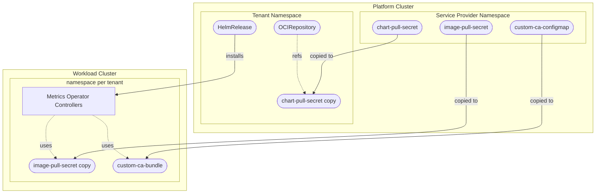

# Air-Gapped Environment Configuration

This document describes how to configure the Metrics Operator service provider for air-gapped or enterprise environments where images and Helm charts need to be pulled from private registries.

## Overview

In air-gapped environments, you typically need to:

1. **Mirror the Metrics Operator Helm chart** to your internal OCI registry
2. **Mirror Metrics Operator images** to your internal container registry
3. **Configure authentication** for both chart and image pulls
4. **Add custom CA certificates** if you use private PKI with self-signed certificates

The Metrics Operator service provider handles this through:

- **`chartPullSecret`**: Credentials for pulling the Helm chart from a private OCI registry
- **`helmValues.global.imagePullSecrets`**: Credentials for pulling Metrics Operator controller images
- **`caBundleRef`**: PEM-encoded custom CA bundle if your private OCI registry uses self-signed certificates

## Secret Flow



## Configuration

### ProviderConfig

```yaml
apiVersion: metrics.services.open-control-plane.io/v1alpha1
kind: ProviderConfig
metadata:
  name: metricsoperator
spec:
  # ConfigMapKeySelector pointing to a configmap which holds a PEM-encoded custom CA bundle.
  # Must exist in the service provider's namespace on the platform cluster.
  # The configmap will be automatically copied from the service provider's namespace
  # and configured for the Metrics Operator controllers.
  caBundleRef:
    name: "custom-ca-bundle"
    key: "ca-bundle.crt"
  versions:
    - version: "v1.0.0"
      chartVersion: "v1.0.0"
      # Metrics Operator Helm chart location (private OCI registry)
      chartURL: "oci://registry.internal.corp/charts/metrics-operator"

      # Secret for authenticating to the chart OCI registry.
      # Must exist in the service provider's namespace on the platform cluster.
      # Will be copied to the tenant namespace on the platform cluster.
      chartPullSecret: "chart-registry-credentials"

      # Helm values for Metrics Operator deployment
      helmValues:
        # Image pull secrets for Metrics Operator controllers.
        # These secrets will be automatically copied from the service provider's namespace
        # to the tenant namespace on the Workload Cluster.
        imagePullSecrets:
          - name: "image-registry-credentials"
        # Image location override
        image:
          repository: registry.internal.corp/images/metrics-operator
          tag: v1.0.0
```

### Creating Secrets

Secrets must be created in the service provider's namespace on the platform cluster (the namespace where the service provider pod runs):

```bash
# Chart pull secret (for OCI registry authentication)
kubectl create secret docker-registry chart-registry-credentials \
  --namespace <service-provider-namespace> \
  --docker-server=registry.internal.corp \
  --docker-username=<username> \
  --docker-password=<password>

# Image pull secret (for container image authentication)
kubectl create secret docker-registry image-registry-credentials \
  --namespace <service-provider-namespace> \
  --docker-server=registry.internal.corp \
  --docker-username=<username> \
  --docker-password=<password>
```

### Creating Custom CA ConfigMap

Concatenate all your custom CA certificates into a single PEM file. Each certificate must use the standard PEM format.

```shell
cat /path/to/ca1.crt /path/to/ca2.crt > ca-bundle.crt
```

The resulting file should look like this:

```text
-----BEGIN CERTIFICATE-----
MIIDXTCCAkWgAwIBAgIJAMSO...
-----END CERTIFICATE-----
-----BEGIN CERTIFICATE-----
MIIDXTCCAkWgAwIBAgIJANPQ...
-----END CERTIFICATE-----
```

Create the configmap in the service provider's namespace on the platform cluster:

```shell
kubectl create configmap custom-ca-bundle \
  --from-file=ca-bundle.crt=ca-bundle.crt \
  --namespace <service-provider-namespace>
```

## How It Works

### Chart Pull Secret

1. The secret specified in `chartPullSecret` is copied from the service provider's namespace to the tenant namespace on the platform cluster
2. The `OCIRepository` resource references this secret via `spec.secretRef`
3. The Flux Source Controller uses this secret to authenticate when pulling the Helm chart

### Image Pull Secrets

1. Secrets specified in `helmValues.global.imagePullSecrets` are extracted from the Helm values
2. These secrets are copied from the service provider's namespace on the platform cluster to the tenant namespace on the Workload Cluster
3. The Helm values are passed through to Metrics Operator, which configures the controller pods with these secrets

### Custom CA Bundle

1. The configmap specified in `caBundleRef` is copied from the service provider's namespace on the platform cluster to the tenant namespace on the Workload Cluster, under the fixed name `custom-ca-bundle`
2. The Helm values are adjusted so that the Metrics Operator controller mounts the provided `caBundleRef.key` and sets the `SSL_CERT_DIR` environment variable to add the bundle to the pool of known certificates
3. The Metrics Operator controller is then able to verify certificates signed by the provided custom CA

> [!CAUTION]
> The custom CA certificate is not propagated to the Workload Cluster nodes. If you want to pull images from the same OCI registry you must add the custom CA certificate to the cluster nodes yourself. 

## Complete Example

### Air-Gapped Setup

```yaml
apiVersion: metrics.services.open-control-plane.io/v1alpha1
kind: ProviderConfig
metadata:
  name: metricsoperator
spec:
  caBundleRef:
    name: "harbor-ca-bundle"        # copied to the Workload Cluster under the fixed name 'custom-ca-bundle'
    key: "harbor-ca-bundle.crt"
  versions:
    - version: "v1.0.0"
      chartVersion: "v1.0.0"
      chartURL: "oci://harbor.corp.internal/charts/metrics-operator"
      chartPullSecret: "harbor-credentials"
      helmValues:
        imagePullSecrets:
          - name: "harbor-credentials"
        image:
          repository: harbor.corp.internal/images/metrics-operator
          tag: v1.0.0
```

## Mirroring Images

To mirror Metrics Operator images to your internal registry:

```bash
# Mirror Helm chart
skopeo copy \
  docker://ghcr.io/openmcp-project/charts/metrics-operator:v1.0.0 \
  docker://harbor.corp.internal/charts/metrics-operator:v1.0.0

# Mirror controller image
skopeo copy \
  docker://ghcr.io/openmcp-project/images/metrics-operator:v1.0.0 \
  docker://harbor.corp.internal/images/metrics-operator:v1.0.0
```

## Troubleshooting

### Check Secret Copying

Verify secrets are copied to the correct namespaces:

```bash
# Platform cluster
kubectl get secrets -n mcp--<tenant-id> | grep chart

# Workload cluster
kubectl get secrets -n metrics-operator-<instance-id> | grep image
```

### Check ConfigMap Copying

Verify the CA configmap is copied to the Workload Cluster:

```bash
# Workload cluster
kubectl get cm -n metrics-operator-<instance-id>| grep ca
```

### Check OCIRepository Secret Reference

```bash
# Platform cluster
kubectl get ocirepository metrics-operator -n mcp--<tenant-id> -o jsonpath='{.spec.secretRef}'
```

### Check HelmRelease Values

```bash
# Platform cluster
kubectl get helmrelease metrics-operator -n mcp--<tenant-id> -o jsonpath='{.spec.values}' | jq .
```
